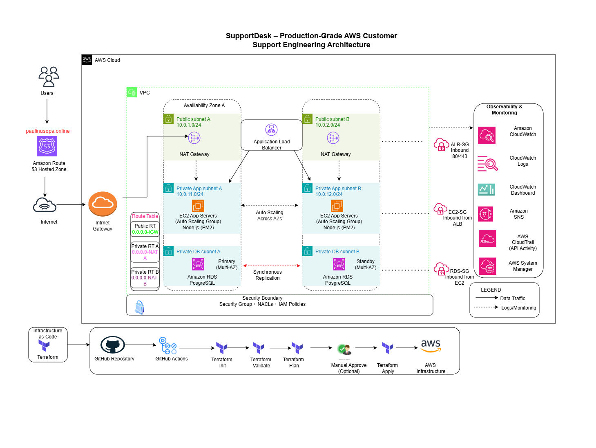

# SupportDesk — End-to-End AWS Customer Support Engineering Platform

## Executive Summary

SupportDesk is a production-style cloud support engineering portfolio project that demonstrates the complete workflow of a Technical Support Engineer operating a SaaS application on AWS.

The platform was designed to simulate a real customer support environment in which users report issues such as application slowness, login failures, database outages, and HTTP 5XX errors. The project includes infrastructure provisioning with Terraform, CI/CD automation with GitHub Actions, monitoring with Amazon CloudWatch, centralized logging, incident response procedures, and operational runbooks.

This repository showcases not only cloud infrastructure skills, but also the investigation, communication, and operational practices expected from a modern support engineer.

---

## Business Scenario

A fictional SaaS company named **SupportDesk** provides customer support software to remote teams.

A customer reports:

> “The application is slow and users cannot log in.”

The support engineer must investigate the incident by examining infrastructure metrics, logs, network components, and database health, then communicate findings and corrective actions.

This project reproduces that exact workflow.

---

## Project Objectives

- Provision AWS infrastructure using Terraform modules.
- Implement a highly available network architecture across two Availability Zones.
- Deploy a Node.js support application behind an Application Load Balancer.
- Host PostgreSQL on Amazon RDS in private subnets.
- Enable centralized logging and monitoring with CloudWatch.
- Generate operational alerts through Amazon SNS.
- Automate infrastructure validation and deployment with GitHub Actions.
- Simulate real incidents for troubleshooting practice.
- Produce professional engineering documentation suitable for a portfolio.

---

## Technology Stack

| Category               | Technology                   |
| ---------------------- | ---------------------------- |
| Cloud Platform         | AWS                          |
| Infrastructure as Code | Terraform                    |
| CI/CD                  | GitHub Actions               |
| Compute                | EC2 Auto Scaling             |
| Load Balancing         | Application Load Balancer    |
| Database               | Amazon RDS PostgreSQL        |
| Monitoring             | CloudWatch                   |
| Notifications          | SNS                          |
| Storage                | Amazon S3                    |
| Backup                 | AWS Backup                   |
| Access Management      | IAM                          |
| Administration         | AWS Systems Manager          |
| Application            | Node.js + Express            |
| Reverse Proxy          | Nginx                        |
| Process Manager        | PM2                          |
| Documentation          | Markdown + Notion (optional) |

---

## High-Level Architecture



### Image Description

Enterprise-grade AWS architecture showing Route 53, Internet Gateway, Application Load Balancer, EC2 Auto Scaling Group across two Availability Zones, private RDS PostgreSQL, CloudWatch, SNS, S3, IAM, Systems Manager, CloudTrail, and a GitHub Actions Terraform CI/CD pipeline.

---

## Key Features

- Multi-AZ VPC design
- Public and private subnet separation
- NAT Gateway outbound internet access
- ALB load balancing
- Auto Scaling for application instances
- Private RDS deployment
- CloudWatch alarms for CPU and ALB 5XX errors
- SNS incident notifications
- Encrypted S3 buckets with versioning
- Infrastructure modularization
- Automated deployment pipeline
- Incident simulation endpoints

---

## Repository Structure

```text
aws-customer-support-engineering-platform/
├── application/
├── diagrams/
├── docs/
├── incidents/
├── runbooks/
├── screenshots/
├── scripts/
├── terraform/
└── .github/
```

---

## Expected Operational Workflow

1. Customer reports an issue.
2. CloudWatch alarm is triggered.
3. Support engineer reviews metrics and logs.
4. Root cause is identified.
5. Corrective action is applied.
6. Customer receives an update.
7. Incident report and preventive actions are documented.

---

## Skills Demonstrated

- AWS networking
- IAM and security design
- Linux administration
- Terraform module design
- CI/CD automation
- Application deployment
- PostgreSQL operations
- Monitoring and alerting
- Incident response
- Technical communication
- Documentation and runbook creation

---

## Screenshot Placeholders

Add these images after deployment:

| Screenshot                               | Description                                 |
| ---------------------------------------- | ------------------------------------------- |
| `screenshots/vpc-overview.png`           | VPC dashboard showing subnets and gateways  |
| `screenshots/alb-dashboard.png`          | Application Load Balancer dashboard         |
| `screenshots/ec2-running.png`            | Running EC2 instances in Auto Scaling Group |
| `screenshots/rds-dashboard.png`          | RDS PostgreSQL instance                     |
| `screenshots/cloudwatch-dashboard.png`   | CloudWatch metrics dashboard                |
| `screenshots/github-actions-success.png` | Successful GitHub Actions workflow          |
| `screenshots/supportdesk-homepage.png`   | Running SupportDesk application             |

---

The project is considered successful when:

- Terraform provisions all infrastructure successfully.
- The application is reachable through the ALB DNS name.
- CloudWatch receives application logs.
- SNS alarms trigger during simulated incidents.
- GitHub Actions validates Terraform on every push.
- Documentation and screenshots are complete.

---

## Target Audience

- Hiring managers
- Technical support engineering recruiters
- Cloud operations teams
- DevOps teams
- Customer success engineering teams

---

## Project Status

**Current Status:** Infrastructure foundation completed. Terraform modules and documentation structure established.
