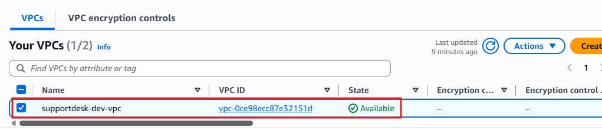
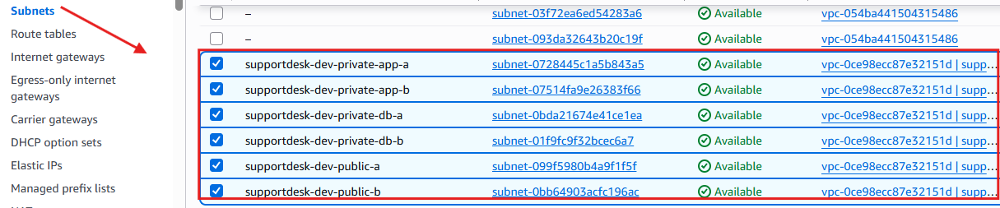
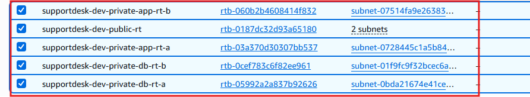

# 03-Networking

## Objective

Provision a highly available network foundation across two Availability Zones.

---

## Components

- VPC
- Internet Gateway
- Public subnets
- Private application subnets
- Private database subnets
- NAT Gateways
- Route tables
- Route table associations

---

## Design Rationale

Public resources are isolated from private workloads. Application and database tiers are separated into dedicated private subnets.

---

## Expected Result

- Internet access available through ALB.
- Private instances use NAT Gateways for outbound traffic.
- Database remains inaccessible from the public internet.

---

## Verification

- VPC exists.
- Six subnets exist.
- Route tables are associated correctly.
- NAT Gateways are in public subnets.

---

- 
- 
- 

**Figure 3:** AWS VPC dashboard showing the SupportDesk VPC, subnets, route tables, and gateways.
