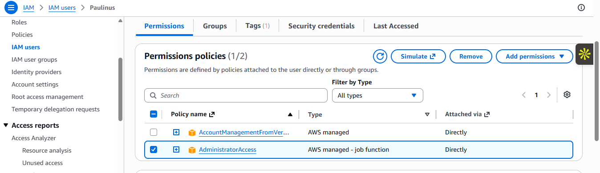

# 04-Security

## Objective

Implement identity and network security controls.

---

## IAM Components

- EC2 IAM Role
- Instance Profile
- CloudWatch Agent Policy
- AmazonSSMManagedInstanceCore Policy

---

## Security Groups

### ALB Security Group

- Inbound: TCP 80 from `0.0.0.0/0`

### EC2 Security Group

- Inbound: TCP 8080 from ALB security group

### RDS Security Group

- Inbound: TCP 5432 from EC2 security group

---

## Security Principles

- Least privilege
- Tier isolation
- No direct database exposure
- Managed access through SSM

---

## Verification

- IAM role attached to EC2.
- Security group rules match the design.

---

- 
- 

**Figure 4:** IAM role attachments and security group rules.
