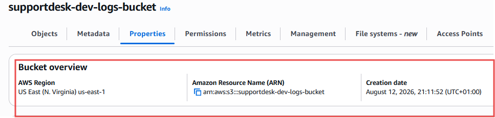

# 07-Storage

## Objective

Provide secure object storage and backup capabilities.

---

## Resources

- Application assets S3 bucket
- Log archive S3 bucket
- AWS Backup Vault

---

## Security Controls

- Versioning enabled
- Server-side encryption enabled
- Public access blocked

---

## Verification

- Buckets are private.
- Encryption is enabled.
- Versioning is enabled.

---

- 
- 

**Figure 7:** S3 bucket configuration and encryption settings.
