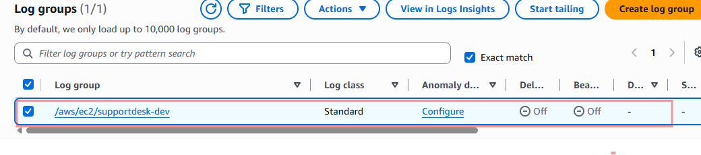
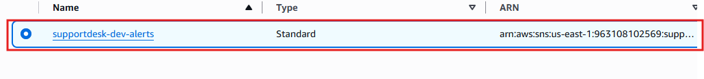

# 08-Monitoring

## Objective

Implement centralized monitoring and alerting.

---

## Components

- CloudWatch Log Group
- SNS Topic
- CPU Alarm
- ALB 5XX Alarm

---

## Alarm Thresholds

| Alarm    | Threshold         |
| -------- | ----------------- |
| High CPU | ≥ 75%             |
| ALB 5XX  | > 5 errors/minute |

---

## Alert Flow

CloudWatch Alarm → SNS Topic → Email/Notification Endpoint

---

## Verification

- Log streams appear in CloudWatch.
- Test alarm enters ALARM state.
- SNS notification is received.

---

- 
- 

**Figure 8:** CloudWatch dashboards, and SNS topic.
