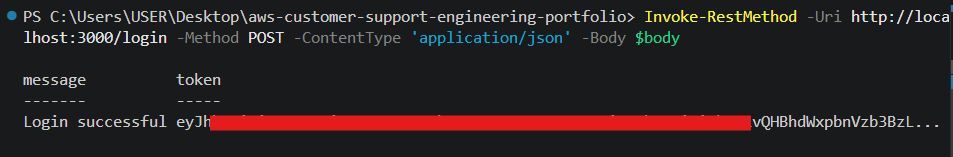
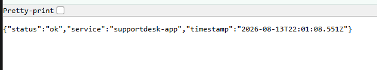
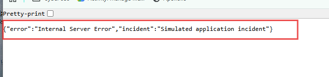
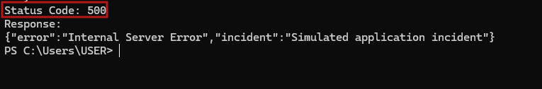
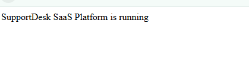
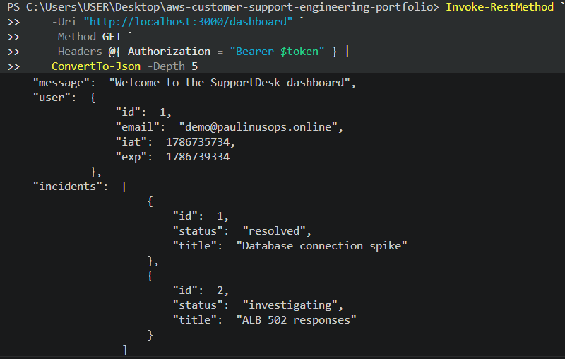

# SupportDesk Application

## Objective

Build a Node.js and Express customer support application that provides a realistic environment for authentication, API testing, incident simulation, and troubleshooting.

---

## Components

- Node.js
- Express.js
- PostgreSQL
- JWT authentication
- bcryptjs
- Helmet
- Morgan
- Health check endpoint
- Protected dashboard
- Incident simulation
- AWS EC2
- Application Load Balancer
- CloudWatch

---

## Design Rationale

The application is designed around common SaaS support scenarios.

Authentication protects the dashboard, while health checks, controlled errors, application logs, and CloudWatch provide practical troubleshooting scenarios.

---

## Application Flow

```text
                    User
                     |
                     v
              Application Load Balancer
                     |
                     v
                 EC2 Instance
                     |
                     v
               Node.js / Express
                  /       \
                 v         v
          PostgreSQL    CloudWatch
                         |
                         v
                    Application Logs
```

---

## Authentication

The application uses JWT authentication with bcrypt password verification.

### Login

```text
POST /login
```

A successful login returns a JWT token.

### Protected Dashboard

```text
GET /dashboard
```

The dashboard requires a valid JWT token.



## Figure 9: Login Authentication

## Health Check

The application provides a simple health endpoint:

```text
GET /health
```

A successful response confirms that the application is running.



Figure 10: SupportDesk Application Health Check

---

## API Endpoints

| Method | Endpoint          | Purpose             |
| ------ | ----------------- | ------------------- |
| GET    | `/`               | Application status  |
| GET    | `/health`         | Health check        |
| POST   | `/login`          | User authentication |
| GET    | `/dashboard`      | Protected dashboard |
| GET    | `/simulate-error` | Incident simulation |

---

## Incident Simulation

The application includes a controlled error endpoint:

```text
GET /simulate-error
```

This intentionally generates an application error so that the incident can be reproduced and investigated.



## Figure 11: Controlled Application Incident Simulation

## Error Handling

The application uses centralized Express error handling.

When an application error occurs, it returns an HTTP 500 response and records the error in the application logs.



Figure 12: Application Error Response

---

## Database Connectivity

The application is designed to connect to PostgreSQL using environment variables.

Common troubleshooting areas include:

- Database availability
- Credentials
- Network connectivity
- Security groups
- Connection timeouts

---

## Logging and Monitoring

Application activity and errors are logged for troubleshooting.

The AWS deployment uses CloudWatch for centralized application logging.

```text
/aws/ec2/supportdesk-dev
```

---

## Deployment

The application runs on the AWS infrastructure provisioned with Terraform.

```text
GitHub Actions
   |
   v
Terraform
   |
   v
AWS Infrastructure
   |
   +------------------+
   |                  |
   v                  v
Application       Monitoring
   |                  |
   v                  v
EC2              CloudWatch
   |
   v
Application Load Balancer
   |
   v
Healthy Target Group
```

Infrastructure configuration is maintained separately under:

```text
Infrastructure/terraform/
```

---

## Verification

The deployment was validated using the following checks:

- Terraform CI/CD workflow completed successfully.
- The required AWS infrastructure was provisioned successfully.
- The Application Load Balancer reached the Active state.
- The target group reported one healthy target and zero unhealthy targets.
- The EC2 application passed the configured ALB health check on port 8080.
- CloudWatch resources were provisioned for centralized logging and monitoring.
- Application authentication and incident simulation endpoints were included as part of the application support environment.

---

### Application Homepage



### Authenticated Dashboard



Figure 13: Authenticaed Dashboard

### Application Health


### Simulated Incident


### Error Response


### CloudWatch Investigation

---

## Outcome

SupportDesk demonstrates the deployment and operation of a cloud-based customer support application environment using Node.js, Express, AWS, Terraform, GitHub Actions, PostgreSQL, and CloudWatch.

The project successfully demonstrates infrastructure-as-code deployment, CI/CD automation, load balancing, EC2 application hosting, health monitoring, centralized logging, authentication, incident simulation, and troubleshooting workflows.

Final infrastructure validation confirmed a successful Terraform deployment, an active Application Load Balancer, and a healthy application target. A database-related application endpoint remained under investigation after returning a 502 Bad Gateway response during final testing.
