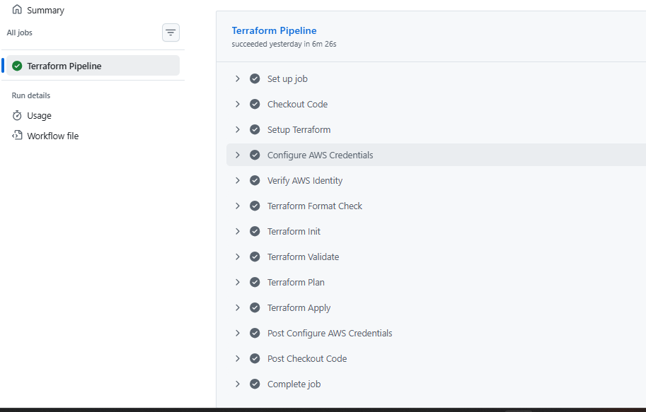

# 09-GitHub-Actions-CI-CD

## Objective

Automate Terraform validation and deployment.

---

## Workflow Stages

1. Checkout repository
2. Setup Terraform
3. `terraform fmt -check`
4. `terraform init`
5. `terraform validate`
6. `terraform plan`
7. Optional approval
8. `terraform apply`

---

## Benefits

- Consistent deployments
- Early validation
- Infrastructure change visibility

---

- 
- `

Figure 14:Successful GitHub Actions Terraform workflow.
