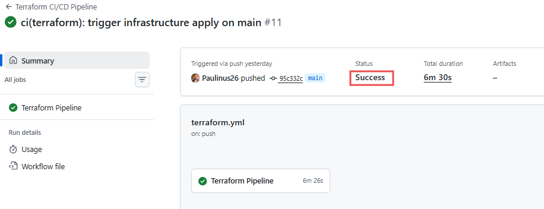
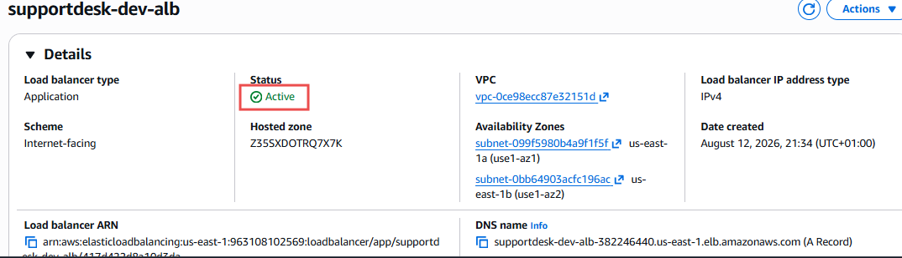
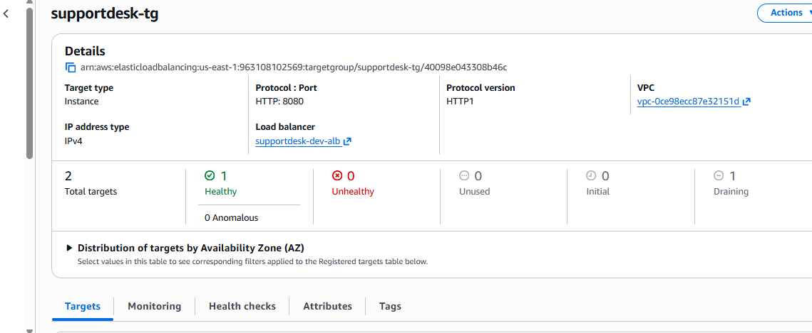

# 10. Deployment Guide

## Deployment Steps

1. Configure the AWS credentials required for Terraform deployment.

2. Create the EC2 key pair in the AWS region used by the project.

3. Configure the required Terraform variables and GitHub Actions secrets.

4. Run the Terraform CI/CD workflow through GitHub Actions.

5. Terraform initializes the remote backend, validates the configuration, creates a plan, and deploys the AWS infrastructure.

6. Confirm that the GitHub Actions workflow completes successfully.

7. Verify that the Application Load Balancer is active.

8. Verify that the EC2 application target is healthy in the ALB target group.

---

## Deployment Validation

The following checks were completed after deployment:

- Terraform CI/CD workflow completed successfully.
- AWS infrastructure was provisioned successfully.
- The Application Load Balancer was created and reached the **Active** state.
- The target group reported **1 healthy target and 0 unhealthy targets**.
- The application health check on port `8080` passed successfully.

These results confirm successful infrastructure deployment and connectivity between the Application Load Balancer and the EC2 application instance.

---

## Application Endpoint Testing

The application health endpoint was configured as:

```text
GET /health
Port: 8080
Expected status code: 200
```

The ALB target group successfully reported the application instance as healthy.

During final testing, the database simulation endpoint returned:

```text
502 Bad Gateway
```

This indicates that the remaining issue is related to application-level request handling or downstream database connectivity. The ALB itself and its health-check connection to the EC2 target remained operational.

---

## Deployment Screenshots

### 1. Successful Terraform CI/CD Workflow



Figure 15: Succesfull GitHub action workflow

### 2. Active Application Load Balancer



Figure 16: Successful provisioning of the Application Load Balancer.

---

### 3. Healthy Target Group



Figure 17: Successful connectivity between the ALB and the EC2 application instance.

---

## Deployment Result

The SupportDesk AWS infrastructure was successfully deployed using Terraform and GitHub Actions. The final deployment included the VPC, networking resources, security groups, Application Load Balancer, EC2 Auto Scaling infrastructure, RDS configuration, S3 storage, monitoring resources, IAM roles, and AWS Backup resources.

The final validation confirmed that the CI/CD workflow completed successfully, the Application Load Balancer was active, and the application target passed its configured health checks.

A `502 Bad Gateway` response remained on the database simulation endpoint during final testing. This was documented as an application or database connectivity troubleshooting scenario for further investigation.
