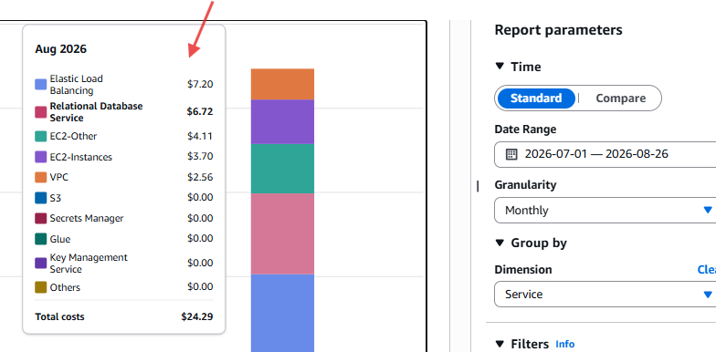

# 13-Cost-Optimization

## Estimated Development Costs

| Service         | Notes                                                       |
| --------------- | ----------------------------------------------------------- |
| EC2 t2.micro    | Eligible for Free Tier                                      |
| RDS db.t3.micro | Eligible for Free Tier (Single-AZ recommended for practice) |
| S3              | Minimal                                                     |
| CloudWatch      | Minimal                                                     |
| SNS             | Minimal                                                     |
| ALB             | Billable                                                    |
| NAT Gateway     | Billable                                                    |

---

## Cost Reduction Strategy

For practice environments:

- Use a single NAT Gateway.
- Use Single-AZ RDS.
- Destroy resources after testing.
- Keep only documentation and screenshots.

---

## Screenshot Placeholder

- 

Figure 18: AWS Cost Explorer showing project spend.
