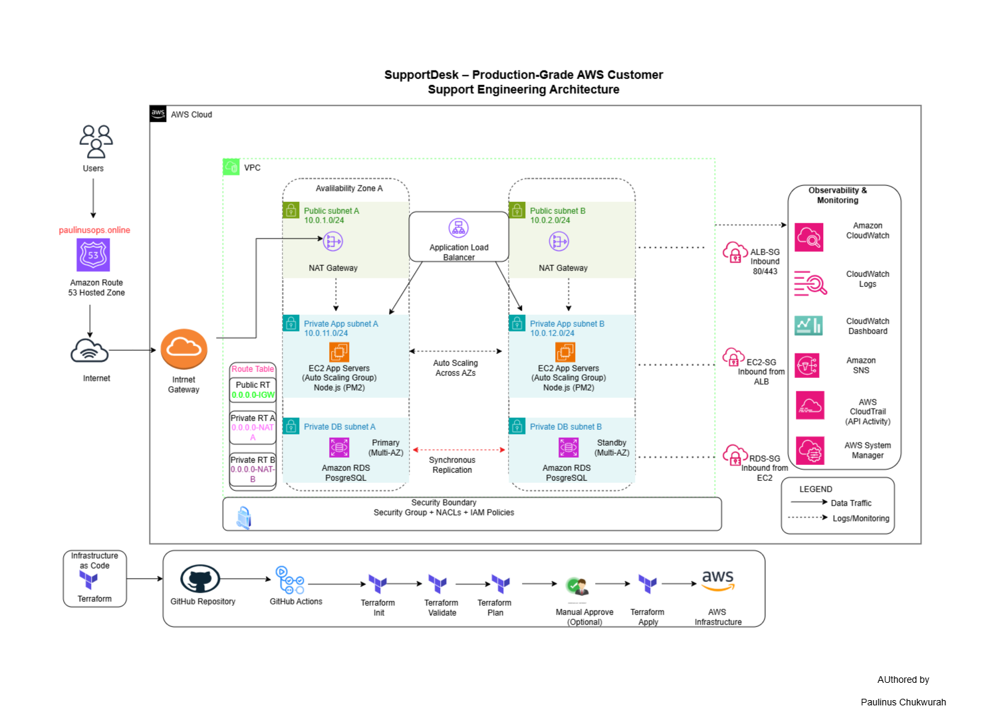

# SupportDesk AWS Customer Support Engineering Platform

## Overview

SupportDesk is a customer support engineering platform designed to
resemble a production SaaS environment.

The project demonstrates AWS infrastructure provisioning, Terraform
Infrastructure as Code, Node.js application deployment, API
troubleshooting, authentication, PostgreSQL connectivity, monitoring,
logging, and incident investigation.

## Architecture

## Technology Stack

- AWS
- Terraform
- GitHub Actions
- Node.js
- Express.js
- PostgreSQL
- EC2
- Application Load Balancer
- Auto Scaling
- CloudWatch
- IAM
- Amazon SNS
- AWS Systems Manager

## Infrastructure

Terraform provisions the core AWS infrastructure, including:

- VPC and subnet architecture
- Application Load Balancer
- EC2 Auto Scaling
- PostgreSQL RDS
- Security Groups
- IAM
- S3
- CloudWatch
- SNS
- AWS Backup

## Application

The Node.js application provides:

- Health checks
- JWT authentication
- Protected dashboard
- PostgreSQL connectivity
- Incident simulation
- Centralized error handling

## CI/CD

GitHub Actions automates:

1. Terraform formatting
2. Terraform initialization
3. Terraform validation
4. Terraform planning
5. Terraform application

## Documentation

Explore the project documentation:

- [Architecture](Infrastructure/docs/01-Architecture.md)
- [Infrastructure Design](Infrastructure/docs/02-Infrastructure-Design.md)
- [Application Design](Infrastructure/docs/03-Application-Design.md)
- [Security](Infrastructure/docs/04-Security.md)
- [Monitoring](Infrastructure/docs/05-Monitoring.md)
- [Incident Response](Infrastructure/docs/06-Incident-Response.md)
- [Deployment Guide](Infrastructure/docs/07-Deployment-Guide.md)
- [Troubleshooting](Infrastructure/docs/08-Troubleshooting.md)

## Project Evidence

The project includes architecture diagrams, infrastructure
configuration, application code, CI/CD workflow evidence, and
deployment and troubleshooting documentation.
